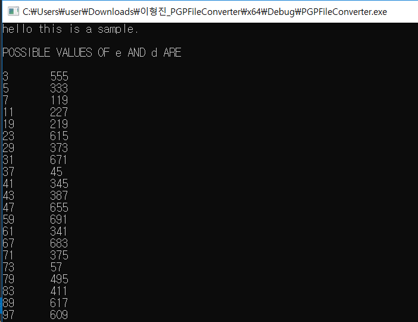
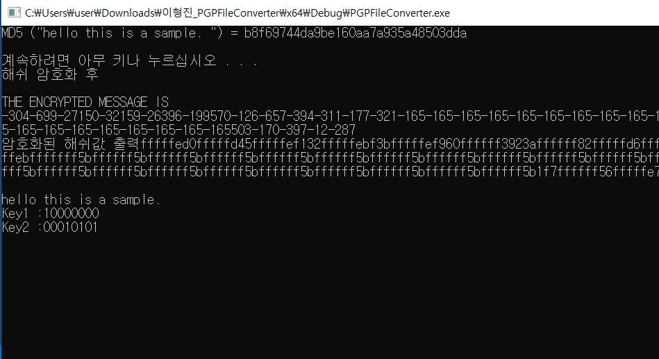
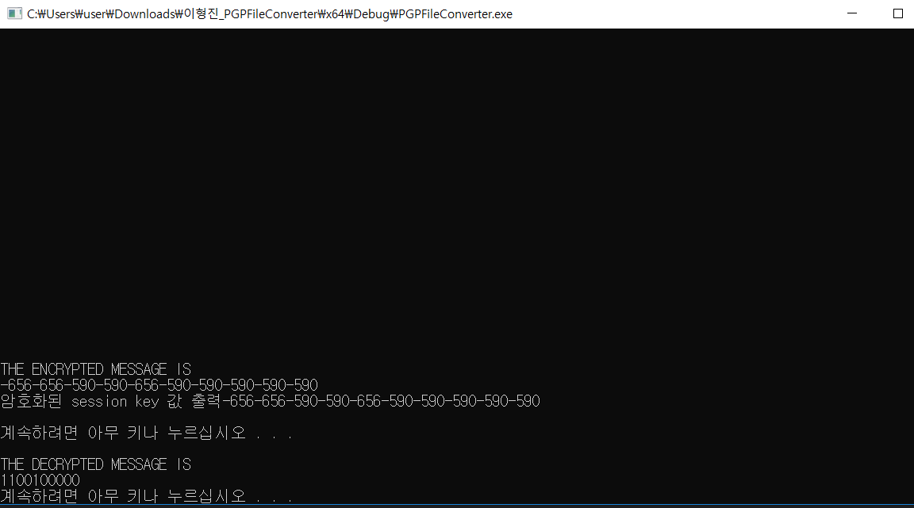
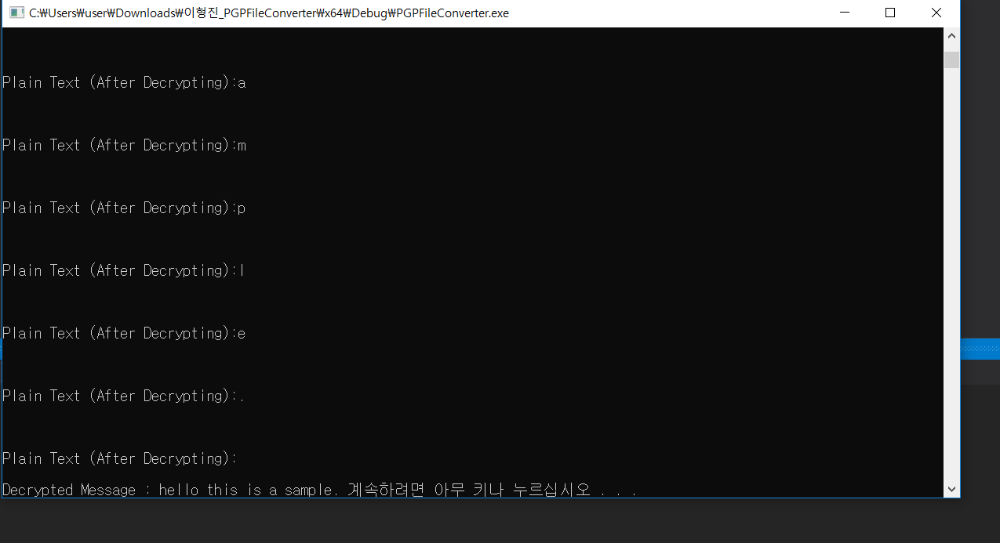
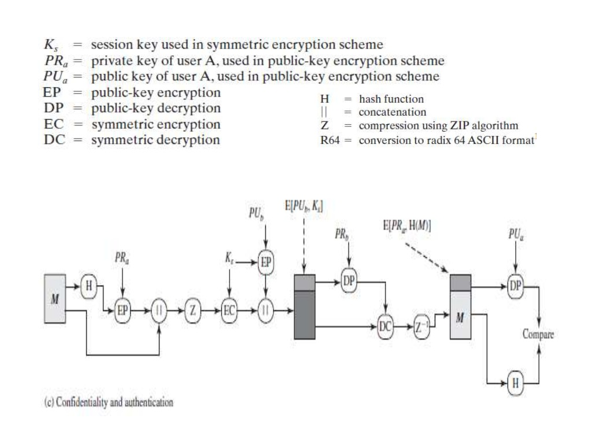

# PGPService
Implemented in C++ Environment in order to get an intuition about how PGPService works.

# Folder Structure
	img: 실행화면 캡쳐
	src: 작업한 소스코드
  
# Development Environment

  Visual Studio 2019, SDK - 10.0.0
  
# Program Screen Shots

rda로 공개키, 개인키 생성 후 유저에게 분배

md5로 해쉬값 추출 

암호화된 session key 값 

복호화된 plain text

# Test Case

네트워크 상에서의 노드를 표현하기 위해 User 객체를 만들고, 두 사용자가 PGP Operation Algorithm을 이용하여 정보를 주고 받는 상황을 설정함.

# References

PGP Operation - Confidentiality and Authentication

https://en.wikipedia.org/wiki/Pretty_Good_Privacy

